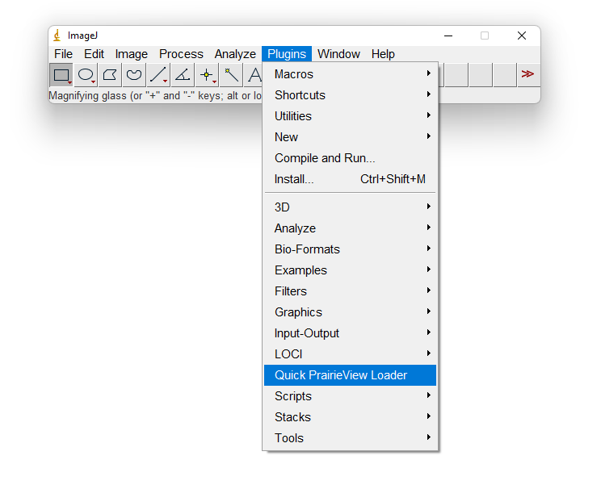

# QuickPV

**QuickPV is an ImageJ plugin for quickly loading large PrairieView TSeries folders as 5D hyperstacks.** Image metadata is read from XML using code from the [bioformats](https://github.com/ome/bioformats/blob/master/components/formats-gpl/src/loci/formats/in/PrairieMetadata.java) library, but performance is enhanced by limiting the number of times the filesystem is scanned and XML documents are parsed and interpreted.

## Installation

* [Stock ImageJ](https://imagej.nih.gov/ij/download.html) (not [Fiji](https://fiji.sc/)) is recommended for performance

* Download the plugin `.jar` from the [Releases page](https://github.com/swharden/ImageJ-QuickPV/releases/) 

* Place the `.jar` in ImageJ's `plugins/` folder and restart ImageJ

* Click `Plugins`, `Quick PrairieView Loader`, and select a TSeries XML file

## Build from Source

* Get the [JDK](https://www.oracle.com/java/technologies/downloads/)

* Download [Maven](https://maven.apache.org/download.cgi) and extract it somewhere important

* Create `JAVA_HOME` environment variable with value `C:\Program Files\Java\jdk-17.0.2`

* Create `MAVEN_HOME` environment variable with value `C:\path\to\apache-maven-3.8.4`

* Add `C:\path\to\apache-maven-3.8.4\bin` to your list of system path variables

* Run `mvn -v` to verify Maven is setup correctly

* Run `mvn` in this folder to compile the plugin and put it in `target/`